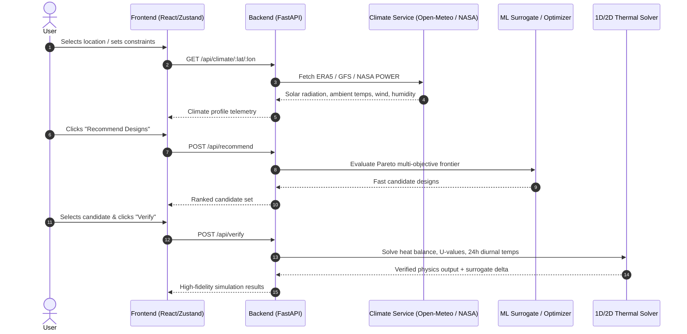

# THERMO-SHIELD — API Contract Specification

**Document Version**: 1.0.0  
**Status**: Approved Source of Truth  
**Target Backend**: FastAPI (Python 3.11+)  
**Target Client**: React + TypeScript (`frontend/`)

---

## Architecture Overview



---

## 1. Global Conventions & Standards

- **Base URL**: `/api`
- **Data Format**: `application/json` (UTF-8)
- **Timestamps**: ISO 8601 UTC string (e.g. `2026-09-02T06:30:00.000Z`)
- **Unit Standards**:
  - Temperature: Degrees Celsius (`°C`)
  - Thermal Transmittance ($U$-value): $\text{W}/(\text{m}^2\cdot\text{K})$
  - Solar Irradiance / Heat Flux: $\text{W}/\text{m}^2$
  - Energy / Heating Demand: $\text{kWh}/\text{day}$
  - Dimensions / Thickness: Meters (`m`) or Millimeters (`mm`) where specified
  - Mass / Weight: Kilograms (`kg`)
  - Cost: Currency units (INR / ₹)
  - Coordinates: Decimal degrees (`lat`, `lon`)

---

## 2. Endpoints Specification

### 2.1 `POST /api/simulate`
Executes a single-design numerical thermal physics simulation on a fully specified shelter geometry and envelope configuration.

#### Request Body
```json
{
  "location": {
    "lat": 34.1526,
    "lon": 77.5771,
    "altitude": 3524
  },
  "shape": "rectangular",
  "orientation": 180,
  "wallMaterial": "adobe",
  "roofMaterial": "timber_insulated",
  "insulation": 100,
  "opening": 14,
  "thermalMass": "high",
  "length": 6.0,
  "width": 4.0,
  "height": 2.5
}
```

#### Request Schema Attributes
| Field | Type | Required | Description |
| :--- | :--- | :--- | :--- |
| `location.lat` | `float` | Yes | Latitude in decimal degrees (-90.0 to 90.0) |
| `location.lon` | `float` | Yes | Longitude in decimal degrees (-180.0 to 180.0) |
| `location.altitude` | `float` | No | Altitude above sea level in meters |
| `shape` | `string` | Yes | `"rectangular" \| "semidome" \| "aframe"` |
| `orientation` | `float` | Yes | Degrees clockwise from North (0°=N, 90°=E, 180°=S, 270°=W) |
| `wallMaterial` | `string` | Yes | Identifier from materials database (e.g., `"adobe"`, `"stone"`, `"rammed_earth"`) |
| `roofMaterial` | `string` | Yes | Identifier from materials database (e.g., `"timber_insulated"`, `"puff_panel"`) |
| `insulation` | `float` | Yes | Insulation thickness in millimeters (25 to 200 mm) |
| `opening` | `float` | Yes | Aperture / glazing percentage of south façade (5% to 30%) |
| `thermalMass` | `string` | Yes | `"low" \| "medium" \| "high"` |
| `length` | `float` | Yes | Shelter length in meters (2.0 to 20.0 m) |
| `width` | `float` | Yes | Shelter width in meters (2.0 to 20.0 m) |
| `height` | `float` | Yes | Shelter height at ridge in meters (1.5 to 6.0 m) |

#### Response Body (`200 OK`)
```json
{
  "uValue": 0.28,
  "indoorTempSeries": [
    { "time": "00:00", "temp": 3.2, "outdoorTemp": -18.0, "solarRad": 0.0, "heatFlux": -32.5 },
    { "time": "01:00", "temp": 2.8, "outdoorTemp": -18.6, "solarRad": 0.0, "heatFlux": -33.1 },
    { "time": "12:00", "temp": 11.4, "outdoorTemp": -9.2, "solarRad": 520.0, "heatFlux": 142.0 },
    { "time": "23:00", "temp": 4.1, "outdoorTemp": -17.2, "solarRad": 0.0, "heatFlux": -30.8 }
  ],
  "meanIndoorTemp": 6.8,
  "solarGain": 218.0,
  "heatLoss": -19.5,
  "heatingDemand": 2.7,
  "comfortPercent": 68.5,
  "weight": 4250.0,
  "cost": 185000.0,
  "estimated": false
}
```

---

### 2.2 `POST /api/recommend`
Given a site location and baseline user requirements, evaluates the multi-objective parameter space using the fast ML surrogate model to generate a Pareto-optimal set of design recommendations balancing thermal comfort, weight, and budget.

#### Request Body
```json
{
  "location": {
    "lat": 34.1526,
    "lon": 77.5771
  },
  "requirements": {
    "length": 6.0,
    "occupants": 4,
    "budget": 250000.0,
    "weightLimit": 5000.0,
    "minComfortPercent": 60.0
  }
}
```

#### Response Body (`200 OK`)
```json
{
  "candidates": [
    {
      "id": "cand-pareto-01",
      "params": {
        "location": { "lat": 34.1526, "lon": 77.5771, "altitude": 3524 },
        "shape": "semidome",
        "orientation": 180,
        "wallMaterial": "adobe_stone_composite",
        "roofMaterial": "puff_sandwich",
        "insulation": 150,
        "opening": 18,
        "thermalMass": "high",
        "length": 6.0,
        "width": 4.0,
        "height": 2.5
      },
      "results": {
        "uValue": 0.22,
        "indoorTempSeries": [
          { "time": "00:00", "temp": 5.4, "outdoorTemp": -18.0, "solarRad": 0.0, "heatFlux": -18.2 }
        ],
        "meanIndoorTemp": 8.4,
        "solarGain": 242.0,
        "heatLoss": -16.2,
        "heatingDemand": 2.1,
        "comfortPercent": 76.0,
        "weight": 4800.0,
        "cost": 210000.0,
        "estimated": true
      },
      "tradeoffNotes": "Maximum thermal comfort (+8.4°C mean) leveraging south aperture and high thermal mass; near upper budget threshold.",
      "paretoRank": 1
    },
    {
      "id": "cand-pareto-02",
      "params": {
        "location": { "lat": 34.1526, "lon": 77.5771, "altitude": 3524 },
        "shape": "rectangular",
        "orientation": 175,
        "wallMaterial": "sip_timber",
        "roofMaterial": "sip_timber",
        "insulation": 100,
        "opening": 14,
        "thermalMass": "medium",
        "length": 6.0,
        "width": 4.0,
        "height": 2.4
      },
      "results": {
        "uValue": 0.31,
        "indoorTempSeries": [
          { "time": "00:00", "temp": 3.8, "outdoorTemp": -18.0, "solarRad": 0.0, "heatFlux": -24.0 }
        ],
        "meanIndoorTemp": 6.2,
        "solarGain": 195.0,
        "heatLoss": -22.4,
        "heatingDemand": 3.8,
        "comfortPercent": 62.5,
        "weight": 2100.0,
        "cost": 145000.0,
        "estimated": true
      },
      "tradeoffNotes": "Lightweight deployment configuration with 56% weight reduction for remote airborne transport.",
      "paretoRank": 1
    }
  ],
  "generatedAt": "2026-09-02T12:00:00.000Z"
}
```

---

### 2.3 `POST /api/verify`
Re-runs the rigorous numerical physics model on a candidate design generated by the surrogate model, validating performance metrics and calculating surrogate prediction error delta.

#### Request Body
Same shape as `/api/simulate` request:
```json
{
  "location": {
    "lat": 34.1526,
    "lon": 77.5771,
    "altitude": 3524
  },
  "shape": "semidome",
  "orientation": 180,
  "wallMaterial": "adobe_stone_composite",
  "roofMaterial": "puff_sandwich",
  "insulation": 150,
  "opening": 18,
  "thermalMass": "high",
  "length": 6.0,
  "width": 4.0,
  "height": 2.5
}
```

#### Response Body (`200 OK`)
```json
{
  "uValue": 0.224,
  "indoorTempSeries": [
    { "time": "00:00", "temp": 5.2, "outdoorTemp": -18.0, "solarRad": 0.0, "heatFlux": -18.6 }
  ],
  "meanIndoorTemp": 8.2,
  "solarGain": 240.5,
  "heatLoss": -16.8,
  "heatingDemand": 2.2,
  "comfortPercent": 74.8,
  "weight": 4820.0,
  "cost": 210000.0,
  "estimated": false,
  "verifiedAgainstSurrogate": true,
  "deltaFromSurrogate": 0.2
}
```

---

### 2.4 `GET /api/climate/:lat/:lon`
Fetches real atmospheric, solar irradiance, temperature, and wind data for any given geographic coordinates via Open-Meteo and NASA POWER APIs.

#### Path Parameters
- `lat` (`float`): Latitude (e.g. `34.1526`)
- `lon` (`float`): Longitude (e.g. `77.5771`)

#### Response Body (`200 OK`)
```json
{
  "location": {
    "lat": 34.1526,
    "lon": 77.5771,
    "name": "Leh, Ladakh",
    "altitude": 3524
  },
  "ambientTempRange": {
    "min": -18.2,
    "max": -8.0,
    "avg": -13.5
  },
  "solarIrradiance": {
    "dailyTotalKwh": 4.85,
    "peakWm2": 520.0
  },
  "windSpeed": {
    "avgMs": 3.2,
    "maxMs": 7.8
  },
  "humidity": {
    "avgPercent": 24.5
  },
  "snowData": {
    "annualSnowfallMm": 115.0,
    "maxSnowDepthCm": 22.0
  },
  "source": "merged",
  "fetchedAt": "2026-09-02T12:00:00.000Z"
}
```

---

### 2.5 `GET /api/materials`
Retrieves the complete thermophysical materials database, including conventional construction materials, insulation composites, and Phase Change Materials (PCM).

#### Response Body (`200 OK`)
```json
[
  {
    "id": "adobe_dense",
    "name": "Dense Adobe / Mud Brick",
    "category": "wall",
    "thermalConductivity": 0.52,
    "density": 1700.0,
    "specificHeat": 1000.0,
    "thickness": 0.30,
    "emissivity": 0.90,
    "solarAbsorptivity": 0.70,
    "pcmMeltingPoint": null,
    "pcmLatentHeat": null,
    "cost": 1200.0,
    "weight": 510.0,
    "carbonFactor": 0.08
  },
  {
    "id": "pcm_paraffin_23",
    "name": "Microencapsulated Paraffin PCM (23°C)",
    "category": "pcm",
    "thermalConductivity": 0.21,
    "density": 860.0,
    "specificHeat": 2200.0,
    "thickness": 0.02,
    "emissivity": 0.88,
    "solarAbsorptivity": 0.40,
    "pcmMeltingPoint": 23.0,
    "pcmLatentHeat": 185.0,
    "cost": 4500.0,
    "weight": 17.2,
    "carbonFactor": 1.45
  },
  {
    "id": "aerogel_insulation",
    "name": "Silica Aerogel Blanket",
    "category": "insulation",
    "thermalConductivity": 0.015,
    "density": 150.0,
    "specificHeat": 1000.0,
    "thickness": 0.025,
    "emissivity": 0.85,
    "solarAbsorptivity": 0.20,
    "pcmMeltingPoint": null,
    "pcmLatentHeat": null,
    "cost": 6500.0,
    "weight": 3.75,
    "carbonFactor": 2.10
  }
]
```

---

### 2.6 `GET /api/locations`
**Location Search Strategy**:
The system implements a **dual-mode location strategy**:
1. **Preset Indian Bioclimatic Archetypes**: Fast reference datasets (Leh, Jaisalmer, New Delhi, Kochi, Srinagar) served by `/api/locations`.
2. **Arbitrary Coordinate/Map Geolocation**: Dynamic query to `/api/climate/:lat/:lon` with live weather resolution via Open-Meteo & NASA POWER.

#### Response Body (`200 OK`)
```json
[
  {
    "id": "leh",
    "name": "Leh, Ladakh",
    "region": "Ladakh (High Altitude Cold Desert)",
    "zone": "Cold & Arid",
    "season": "Winter (January)",
    "lat": 34.1526,
    "lon": 77.5771,
    "altitude": 3524
  },
  {
    "id": "jaisalmer",
    "name": "Jaisalmer, Rajasthan",
    "region": "Thar Desert",
    "zone": "Hot & Dry",
    "season": "Winter / Design Day",
    "lat": 26.9157,
    "lon": 70.9083,
    "altitude": 225
  },
  {
    "id": "delhi",
    "name": "New Delhi, NCR",
    "region": "Indo-Gangetic Plain",
    "zone": "Composite",
    "season": "Winter (January)",
    "lat": 28.6139,
    "lon": 77.2090,
    "altitude": 216
  },
  {
    "id": "kochi",
    "name": "Kochi, Kerala",
    "region": "Malabar Coast",
    "zone": "Warm & Humid",
    "season": "Annual Tropical",
    "lat": 9.9312,
    "lon": 76.2673,
    "altitude": 4
  },
  {
    "id": "srinagar",
    "name": "Srinagar, Kashmir",
    "region": "Kashmir Valley",
    "zone": "Cold & Cloudy",
    "season": "Winter (January)",
    "lat": 34.0837,
    "lon": 74.7973,
    "altitude": 1585
  }
]
```

---

## 3. Error Responses Schema

All API error responses follow the standard RFC 7807 problem details format:

```json
{
  "detail": "Invalid parameter value: insulation must be between 25 and 200 mm",
  "errorCode": "ERR_INVALID_PARAMS",
  "status": 422,
  "timestamp": "2026-09-02T12:00:00.000Z"
}
```
