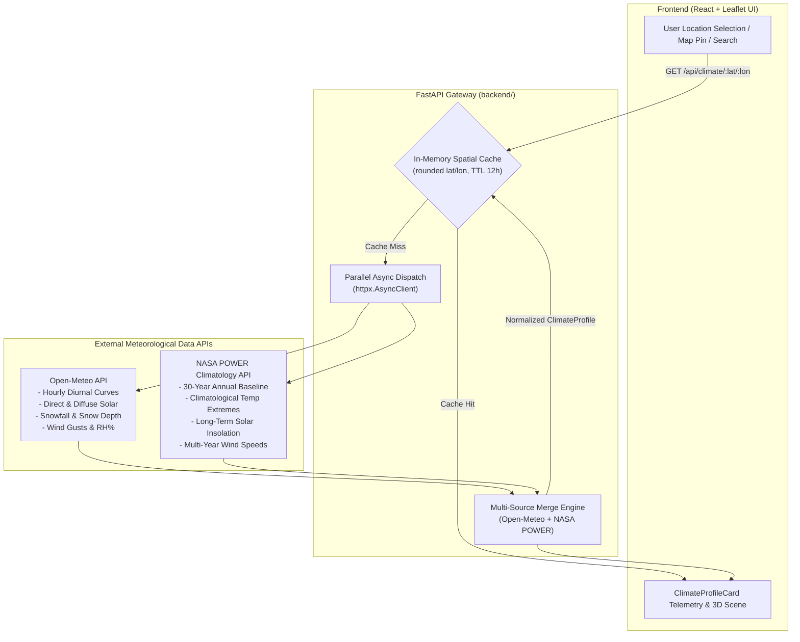

# THERMO-SHIELD — Architecture & Climate Integration Specification

**System**: THERMO-SHIELD (Smart India Hackathon PS 26051 - DRDO/iDEX)  
**Document**: Multi-Source Climate Data Pipeline & Architecture  
**Version**: 1.0.0  

---

## 1. Multi-Source Climate Integration Overview

THERMO-SHIELD couples high-resolution meteorological forecasting APIs with multi-decadal satellite climatology to deliver site-specific microclimatic profiles for passive thermal shelter design across any geographic coordinates.

---

## 2. Merging Rules & Source Prioritization

To ensure both dynamic diurnal fidelity (required for 24-hour thermal damping simulations) and multi-decadal climatological accuracy, the engine executes the following explicit merge rules:

| Climate Field | Primary Provider | Fallback / Climatology Anchor | Rationale |
| :--- | :--- | :--- | :--- |
| **Hourly Outdoor Temp** | Open-Meteo (`temperature_2m`) | Synthetic diurnal cosine model | Required for dynamic 24h thermal replay & physics solver boundary conditions. |
| **Ambient Temp Bounds (Min/Max/Avg)** | Open-Meteo daily stats | NASA POWER (`T2M_MIN`, `T2M_MAX`, `T2M`) | Combines day-of-interest extremes with 30-year climatology baseline validation. |
| **Direct & Diffuse Solar Irradiance** | Open-Meteo (`direct_normal_irradiance` + `diffuse_radiation`) | NASA POWER (`ALLSKY_SFC_SW_DWN`) | High temporal resolution hourly flux captures peak solar hour for south-facing envelope apertures. |
| **Solar Insolation (Daily kWh/m²)** | Open-Meteo (`shortwave_radiation_sum` / 3.6) | NASA POWER (`ALLSKY_SFC_SW_DWN` ANN) | Direct kWh conversion calibrated against multi-year insolation data. |
| **Wind Speed (Avg & Max)** | Open-Meteo (`wind_speed_10m`, `wind_speed_10m_max`) | NASA POWER (`WS10M`) | Captures local turbulent gusts for convective boundary coefficient calculations. |
| **Relative Humidity (%)** | Open-Meteo (`relative_humidity_2m`) | NASA POWER (`RH2M`) | Crucial for latent heat exchange and bioclimatic psychrometric assessment. |
| **Snowfall & Snow Depth** | Open-Meteo (`snowfall`, `snow_depth`) | Altitude / Zone heuristic | Guides roof pitch recommendations (Dhajji-Dewari style) and structural snow-load envelope design. |

### Source Degradation Strategy
1. **Both Open-Meteo & NASA POWER available**: `source = "merged"`. Complete telemetry with high temporal resolution and climatological validation.
2. **Open-Meteo only (NASA timeout/error)**: `source = "open-meteo"`. Uses forecast/real-time diurnal curves.
3. **NASA POWER only (Open-Meteo timeout/error)**: `source = "nasa-power"`. Uses 30-year annual averages and generates diurnal sinusoidal approximations.
4. **Both external APIs fail (Offline mode)**: `source = "fallback"`. Returns high-altitude cold desert or warm-humid standard reference archetype based on latitude threshold, ensuring zero crash in remote/tactical deployments.

---

## 3. Spatial Caching Strategy

- **Key**: Coordinate tuple `(round(lat, 3), round(lon, 3))` providing ~110m spatial resolution.
- **TTL**: 12 hours (`43200` seconds).
- **Benefits**: Prevents rate-limiting on NASA POWER & Open-Meteo servers during repeated scenario comparisons, what-if analyses, and optimization loops.

---

## 4. Frontend Location & Climate Architecture

- **Map Widget**: Leaflet interactive map with custom dark engineering tiles, live pinpoint crosshair, and elevation readout.
- **Place Search**: Open-Meteo Geocoding integration with debounced autocomplete and fast selection.
- **Bioclimatic Classification**: Automated bioclimatic zone derivation (Cold & Arid, Hot & Dry, Composite, Warm & Humid, Cold & Cloudy) based on temperature, altitude, and humidity metrics.
- **Design Priority Synthesis**: Auto-generated engineering recommendations (insulation thickness, south aperture ratio, thermal mass, ventilation strategies) derived directly from live climate telemetry.
